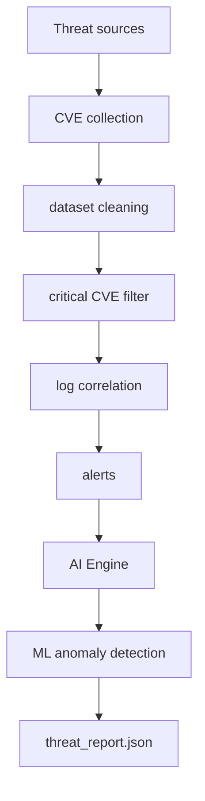
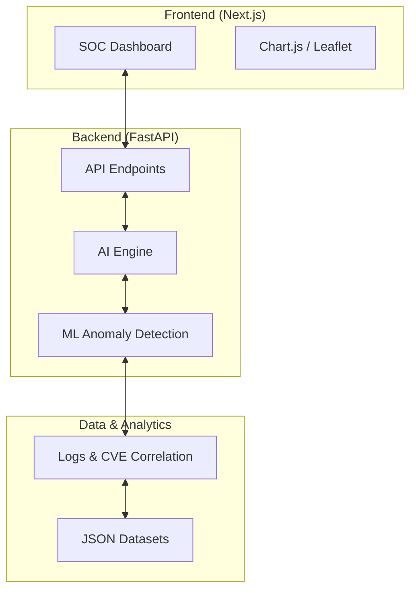

# Système Automatisé de Collecte et de Contextualisation de Données de Cybermenaces avec Agents IA

## 1. Introduction

Avec l’augmentation des cyberattaques, il devient important de surveiller les informations liées aux menaces informatiques. Ces informations peuvent provenir de plusieurs sources comme les actualités cybersécurité, les forums ou le dark web.

Cependant, ces données sont souvent non structurées et difficiles à exploiter directement.

Ce projet consiste à développer un système automatisé capable de collecter des données de cybermenaces, d’extraire les informations importantes comme les IOCs, les malwares, les acteurs de menace ou les fuites de données, puis de contextualiser ces informations.

Le système utilisera des agents basés sur l’intelligence artificielle pour analyser les données et générer des insights automatiquement.

## 2. Contexte et Problématique

Les analystes en cybersécurité doivent surveiller plusieurs sources pour détecter les nouvelles menaces.

Ces sources peuvent contenir des informations comme :

- Attaques informatiques
- Malwares
- Fuites de données
- Données du dark web
- Acteurs de menace
- Indicateurs de compromission (IOCs)

Cependant :

- Les données sont dispersées
- Les formats sont différents
- Les données sont non structurées
- L’analyse manuelle prend du temps

Il est donc nécessaire d’automatiser la collecte et l’analyse de ces données.

Le défi est de concevoir un système capable de collecter ces informations automatiquement et d’utiliser l’intelligence artificielle pour en extraire des informations utiles.

## 3. Objectifs du Projet

### Objectif général :

Développer un système automatisé permettant la collecte et la contextualisation de données de cybermenaces en utilisant des agents basés sur l’intelligence artificielle.

### Objectifs spécifiques :

- Collecter automatiquement les données
- Extraire les informations importantes
- Identifier les IOCs
- Détecter les malwares et attaques
- Contextualiser les données
- Générer des insights avec l’IA
- Automatiser les tâches
- Stocker les résultats
- Déployer le système

## 4. Architecture et Stack Technique

### Stack Logicielle

- **Langage**: Python (Backend), Node.js (Frontend)
- **Framework Web**: FastAPI + Uvicorn
- **Base de données**: Fichiers JSON (Initialement)
- **Gestion de version**: Git

### Organisation des Dossiers

- `backend/`: Logique de collecte, traitement, filtrage, détection d'anomalies ML et moteur IA.
- `backend/anomaly_detector.py`: Nouveau module utilisant **Isolation Forest** pour détecter les comportements anormaux dans les logs.
- `frontend/`: Interface utilisateur pour la visualisation des alertes SOC.
- `data/`: Stockage des datasets bruts, nettoyés et alertes.
- `docs/`: Documentation du projet et roadmap.
- `rules/`: Règles de détection d'IOC et de corrélation.

## 5. Flux de Traitement (Pipeline CTI)



1. **Threat sources** : Sources de données brutes (NVD, AlienVault, etc.)
2. **CVE collection** : Récupération des données via API.
3. **dataset cleaning** : Nettoyage et normalisation des données JSON.
4. **critical CVE filter** : Filtrage des vulnérabilités à haut score (CVSS).
5. **log correlation** : Comparaison des logs système avec les CVE identifiées.
6. **alerts** : Génération des premières alertes de sécurité.
7. **AI Engine** : Analyse intelligente des alertes consolidées.
8. **ML anomaly detection** : Détection des comportements anormaux par Isolation Forest.
9. **threat_report.json** : Génération du rapport final pour le SOC.

## 6. Prochaines Étapes et Roadmap

### Phase 1 : Consolidation Backend (En cours)

- Nettoyage et filtrage des données critiques.
- Corrélation robuste Logs <-> CVE.
- Génération du fichier `alerts.json` prédictif.

### Phase 2 : Intégration IA (AI Engine)

- Développement d'un agent IA pour l'analyse des logs en temps réel.
- Entraînement de l'agent sur les patterns d'attaques connus (IOC/CVE).
- Automatisation du rapport de menace et prédiction des vulnérabilités.

### Phase 3 : Interface SOC (Frontend)

- Mise en place de l'API FastAPI pour exposer les données.
- Création du dashboard avec Node.js pour visualiser les alertes et insights.

## 7. Améliorations Futures (Roadmap SOC Avancé)

Pour rendre la plateforme encore plus performante, les étapes suivantes sont prévues :

1.  **Visualisation de Données (Chart.js)** :
    - Intégration de graphiques dynamiques sur le dashboard.
    - Distribution des attaques (CVE exploitation vs ML anomaly vs Critical logs).
2.  **Enrichissement du Threat Report** :
    - Page dédiée affichant les prédictions détaillées, recommandations et niveaux SOC générés par l'AI Engine.
3.  **Cartographie Mondiale des Menaces (Leaflet)** :
    - Carte interactive pour géolocaliser les adresses IP sources des attaques détectées dans les logs.

## 8. Architecture Finale du Système



## 9. Guide d'Intégration et Lancement

### Lancement du Projet

**Étape 1 : Lancer le Backend (API FastAPI)**

```powershell
# Depuis la racine du projet
.\venv\Scripts\python.exe -m backend.api
```

_L'API sera disponible sur http://127.0.0.1:8000_

**Étape 2 : Lancer le Frontend (Next.js Dashboard)**

```powershell
# Dans un second terminal
cd frontend/nextjs-dashboard
npm run dev
```

_Le dashboard sera disponible sur http://localhost:3000_

### Erreurs résolues et Points de vigilance

1.  **Gestion des Chemins (Windows)** :
    - **Problème** : Erreurs Turbopack dues aux caractères spéciaux (`é`) dans les chemins OneDrive.
    - **Solution** : Utilisation forcée de **Webpack** dans le `package.json` (`next dev --webpack`).
2.  **CORS (Cross-Origin Resource Sharing)** :
    - **Problème** : Le navigateur bloque les requêtes du frontend (port 3000) vers le backend (port 8000).
    - **Solution** : Ajout du `CORSMiddleware` dans `backend/api.py` pour autoriser `http://localhost:3000`.
3.  **Environnement Virtuel (venv)** :
    - **Problème** : `ModuleNotFoundError: No module named 'uvicorn'`.
    - **Solution** : Installation explicite des dépendances via `.\venv\Scripts\python.exe -m pip install -r requirements.txt`. Toujours utiliser le chemin complet vers l'exécutable du venv pour garantir l'utilisation du bon environnement.
4.  **Problème de Port Occupé** :
    - **Problème** : Le serveur semble "charger" sans s'arrêter ou échoue à se lancer avec une erreur `Errno 10048`.
    - **Solution** : Vérifier si une autre instance utilise le port 8000 (`netstat -ano | findstr :8000`) et tuer le processus (`taskkill /F /PID <PID>`). Nous avons aussi désactivé `reload=True` pour plus de stabilité sur OneDrive.

LES SITES D'EXTRACTION DES DONNES BRUTES
AlienVault
National Vulnerability Database
MISP
Abuse.ch, URLhaus, ThreatFox
